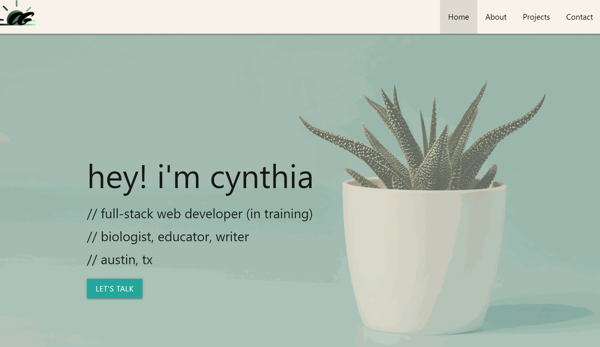
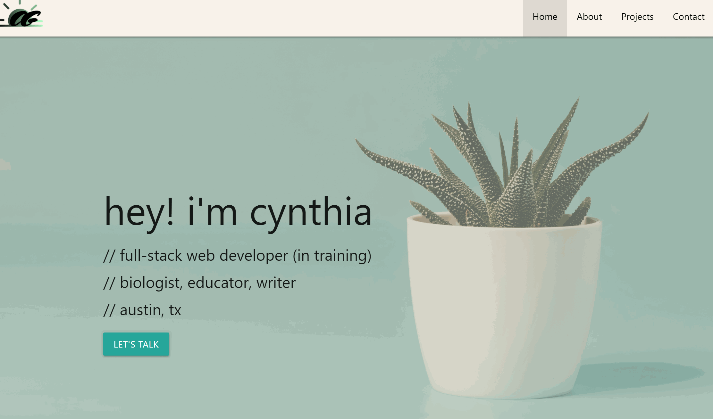

# Portfolio
This is Cynthia Garcia's portfolio site, including descriptions and a showcase of previous web development projects and work. The portfolio also includes credentials and contact information for prospective collaborators and/or clients.

## Deployed Application
Access Cynthia's portfolio [HERE](https://caersun.github.io/portfolio/)

## Technologies Used
- HTML5
- CSS
- Materialize.css
- JavaScript
- jQuery

## What It Looks Like

## License
MIT

## Contact Me
- [Email](i.cynthiagarcia@gmail.com)  
- [Portfolio](https://caersun.github.io/portfolio/)

